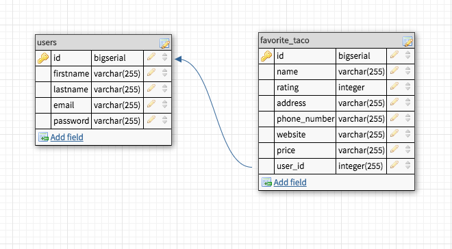
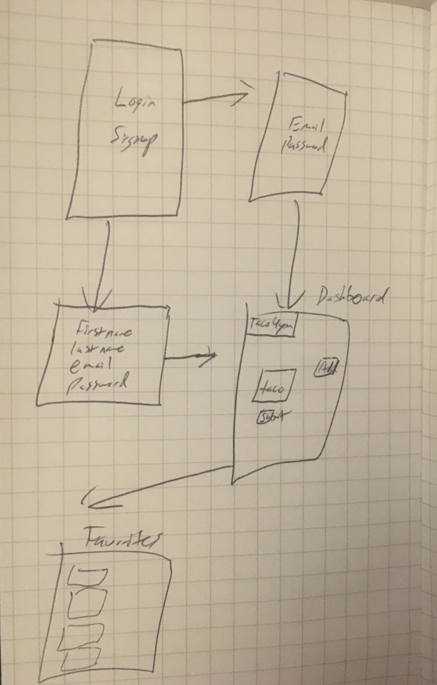
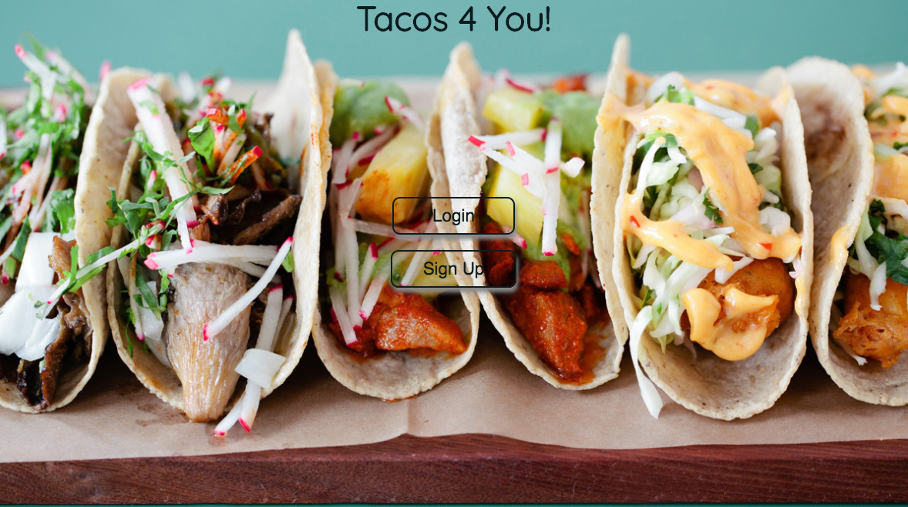
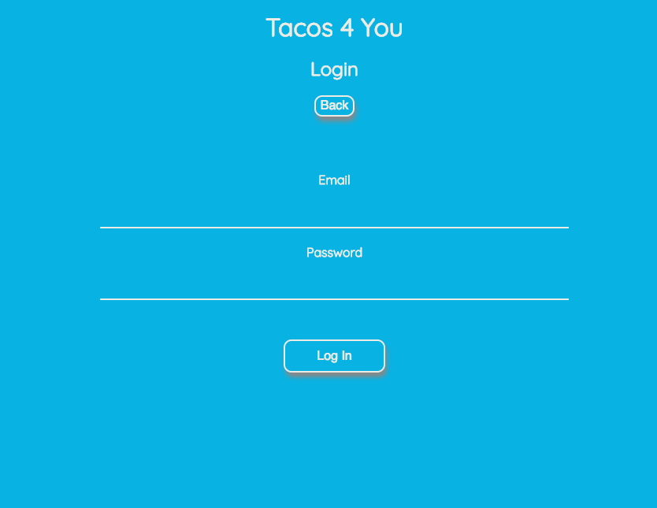
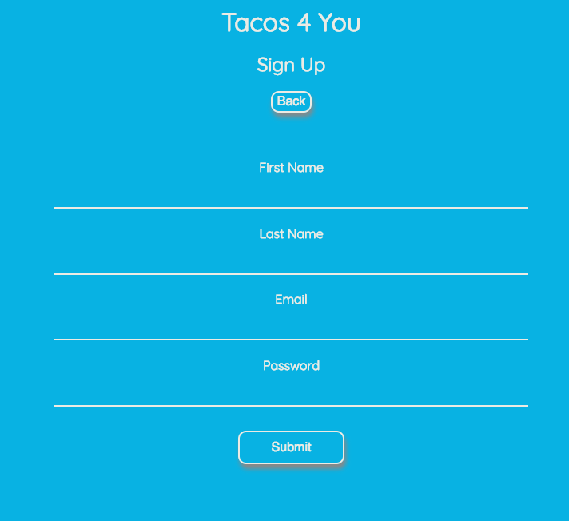
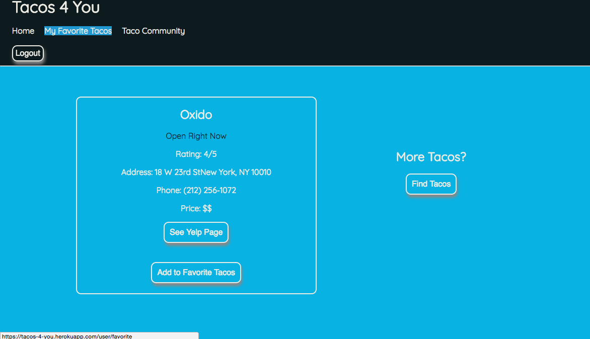
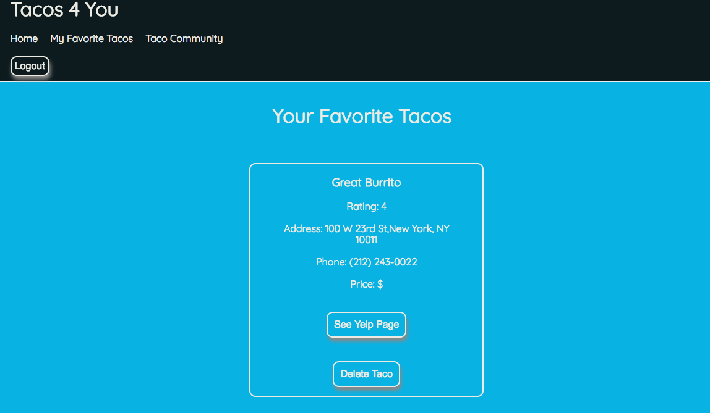
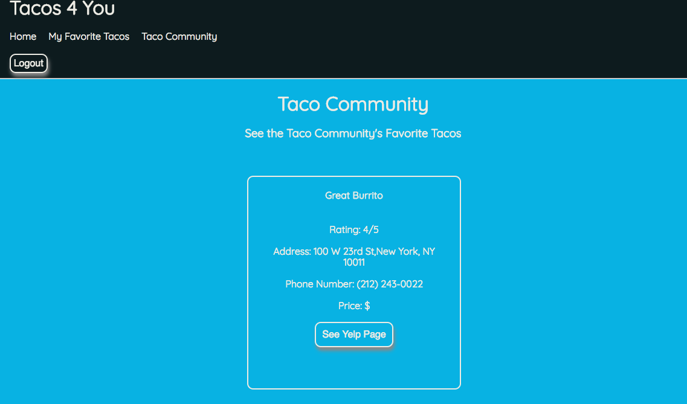

## Project 4 - Tacos 4 You

This is my fourth project for General Assembly's Web Development Immersive program. I created a taco finder that will find a taco restaurant that is within 1.25 miles of where you are located that is rated a 4 or higher on Yelp. You will be able to sign in and favorite a taco as well as see what others are favoriting. I used a navigator geolocation feature to get the user's location. I used the Yelp API to find data from restaurants that the user can eventually go to if they are interested.

## User Stories
1. A user should be able to sign up.
2. A user should be able to log in with their email and password.
3. A user should be able to see taco restaurants within 1.25 miles of their location.
4. A user should be able to click more tacos if they do not like the one they receive first.
5. A user should be able to favorite a taco restaurant.
6. A user should go back to go to the Yelp page of the taco restaurant that comes up.
7. A user should be able to delete a favorite restaurant.
8. A user should be able to see what other taco restaurants are favorited.

## ERD

## Wireframes

## Screenshot of Project

## Technologies

1. React - Used to build out front end
2. Express/node - Used to build out back end
3. Yelp API - Used to get data

## Yelp API

Tacos 4 You was created by using the Yelp API In order to actually use this web application, you will need to get a CLIENT ID and a SECRET key from Yelp.

## React JS Dependencies:

You will need to npm install these following packages:

  "cors": "2.8.3",
  "dotenv-webpack": "1.4.3",
  "express": "4.15.2",
  "jsonwebtoken": "7.3.0",
  "object-assign": "4.1.0",
  "react": "15.4.1",
  "react-addons-update": "15.4.2",
  "react-dom": "15.4.1",
  "react-redux": "5.0.1",
  "react-router": "3.0.0",
  "react-router-redux": "4.0.7",
  "redux": "3.6.0",
  "redux-thunk": "2.1.0"

  [Tacos 4 You Backend](https://github.com/jonrtroy/taco-backend)
